# 拍摄策划工作台 Shooting Plan Workbench

> **一份会计算的智能文档**，不是又一个要部署、要登录、每月付费的 SaaS。
> 单个 HTML 文件，双击即用，离线可填，一键导出 PDF + DOCX。

---

## 这是什么

摄影策划的完整流程里，最花时间的不是「想创意」，而是**把创意写成一份别人能执行的文档**——
摄影助理要照着打包、模特要照着准备、场地要照着报备。

市面上的工具要么是云端协作平台（要联网、传图有隐私顾虑），
要么是 Word 模板（不会算存储卡、不检查必填项）。

这个工作台是**第三种答案**：一个 HTML 文件，打开就是全部功能。

| | 传统 Word 模板 | 云端 SaaS | 本工作台 |
|---|---|---|---|
| 需要安装 | Word | 浏览器 + 联网 | **无** |
| 离线可用 | ✅ | ❌ | ✅ |
| 图片隐私 | 本地 | **上传服务器** | **本地，不出浏览器** |
| 必填项检查 | 靠人肉 | ✅ | ✅ |
| 存储卡算 | 手动算 | ✅ | ✅ |
| 导出 PDF | 手动调版式 | ✅ | ✅ |
| 导出 DOCX | ✅ | ✅ | ✅ |
| 费用 | 0 | 订阅制 | **0** |
| 策划案编号唯一 | ❌ 手工填 | ✅ | ✅ 自动分配 |

> 👉 **第一次来？先看 [上手指南](docs/GETTING-STARTED.md)** —— 15 分钟走完一份真实策划案。
> 要查某个字段怎么填，看 [使用说明](docs/USER-GUIDE.md)。

---

## 两种用法，选一个

### 用法 A · 在线版（推荐给想先试试的）

**点这个网址就能用，不用下载、不用安装：**

### 🌐 https://jasonwithmiracle.github.io/shooting-plan-workbench/online/

打开即用，适合先摸一遍功能。数据存在**你自己浏览器的本地**，
不上传任何服务器 —— 但也因此**换设备不会同步**（见下方「换设备怎么办」）。

### 用法 B · 下载离线版（推荐给正式使用的）

**1. 下载** [`workbench.html`](workbench.html)（114 KB，单个文件）

**2. 双击它**，用 Chrome 或 Edge 打开

> 建议把这个文件**存到桌面或固定位置**，
> 每次双击就能用，不需要每次都去 GitHub 下载页找。

完全离线可用，图片不出浏览器。适合网络不稳定或涉及敏感素材的场合。

### 换设备怎么办

数据存在**浏览器本地**，换电脑不会自动同步。用顶栏的
**「⇩ 导出整案」** 得到一个 `.json` 文件，
在新设备上用 **「⇧ 导入整案」** 恢复 —— 12 个章节的内容、模特库、场地库、编号占用表全部带走。

> ⚠️ 「打印 / 存 PDF」导出的是**排版好的成品**，拿到手是一份死文档，
> **不能用来恢复数据**。换设备请用「导出整案」。

---

## 快速开始

### 1. 打开

下载 [`workbench.html`](workbench.html)，**双击**用浏览器打开。

推荐 Chrome / Edge（部分功能在 Firefox / Safari 上降级，见 [Roadmap](docs/ROADMAP.md)）。

### 2. 填 4 个字段就能导出

| 步骤 | 位置 | 说明 |
|---|---|---|
| ① 分配编号 | §0.1 | 点「分配编号」，自动生成 `CX-20261004-01` 作为本策划案唯一主键 |
| ② 填拍摄信息 | §0.2–0.7 | 日期、时段、地点、主题、模特、摄影师 |
| ③ 补齐核心章节 | 全篇 | 顶栏「强制项完成度」会实时告诉你还差几项 |
| ④ 导出 | 顶栏 | 打印 → 另存 PDF；或导出 DOCX |

### 3. 数据存在哪

**浏览器 localStorage**，不上传任何服务器。
这意味着：

- 关掉浏览器不会丢（自动保存）
- 换浏览器 / 换电脑**不会同步**（数据是本地的）
- 清理浏览器数据会丢

> 想要「数据跟着人走」，见 [Roadmap 的 v2.1 / v3.0](docs/ROADMAP.md)。

---

## 界面预览

| 基本信息 | 布光方案 |
|---|---|
| 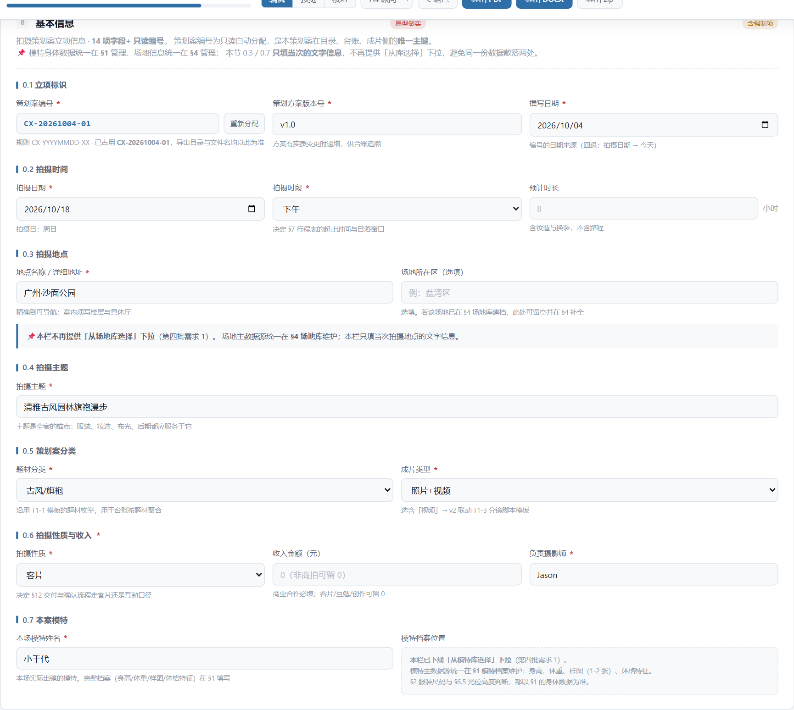 | 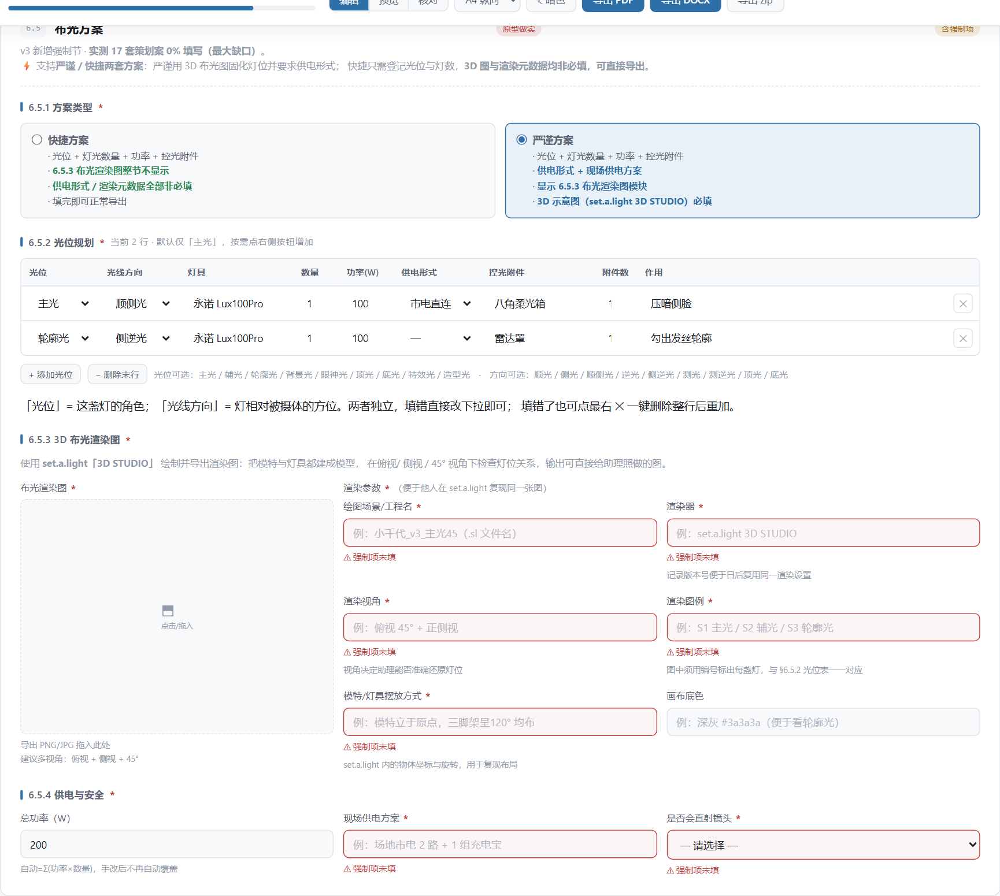 |
| 编号自动分配、14 项要素 | 严谨/ 快捷双模式，光位 9 项 / 方向 11 项 |

| 行程安排 | 参考样片 |
|---|---|
| 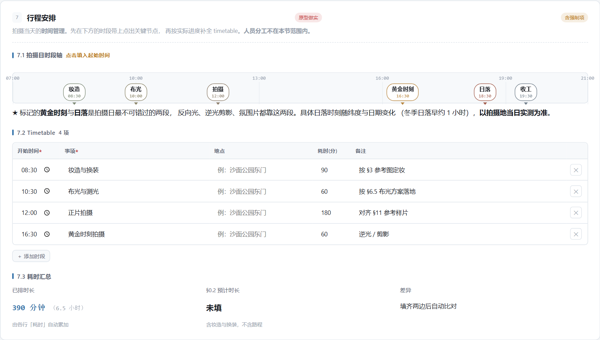 | 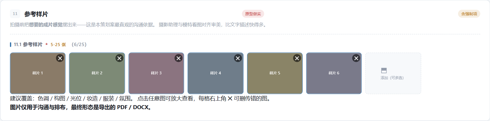 |
| 时段轴含**黄金时刻 / 日落**+ 耗时校验 | 5-25 张，4:3 基准格完整显示，✕ 常驻 |

其余章节（点击展开）

| 章节 | 截图 |
|---|---|
| §1 模特库 | 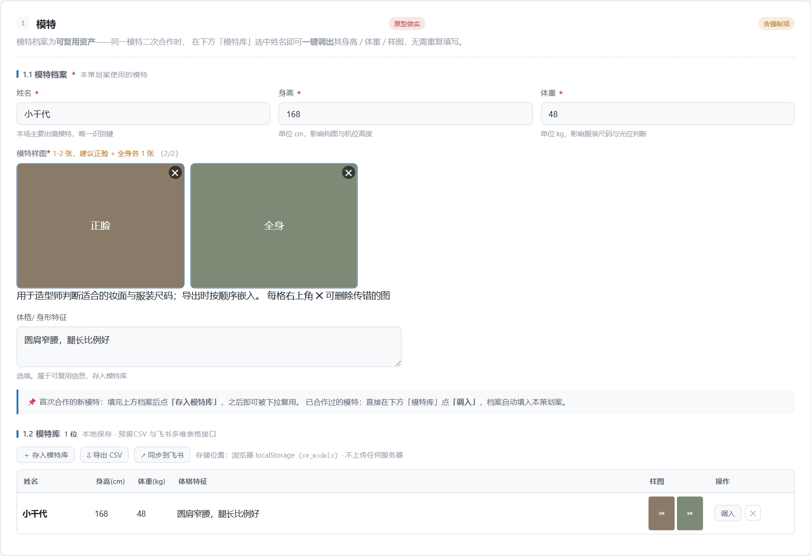 |
| §2 服装 | 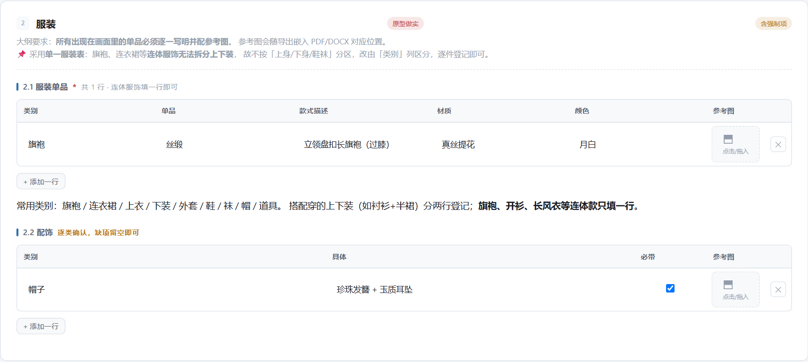 |
| §3 妆造 | 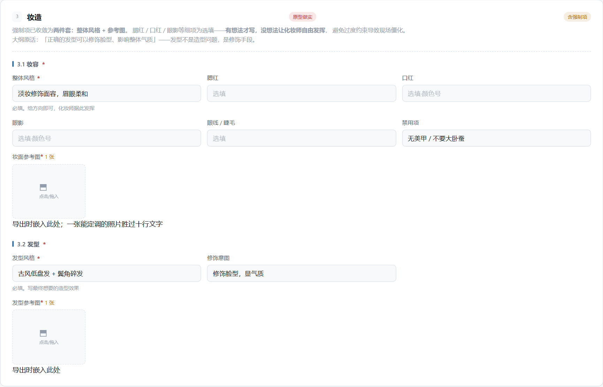 |
| §4 场地库 | 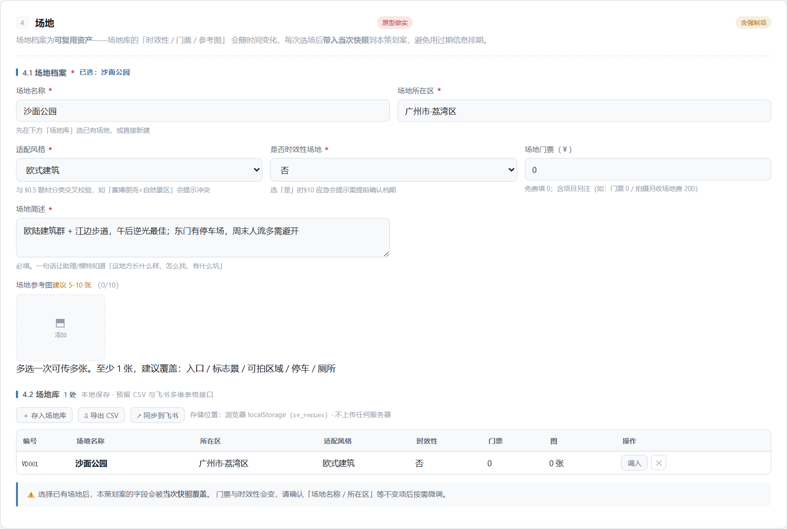 |
| §5 道具 | 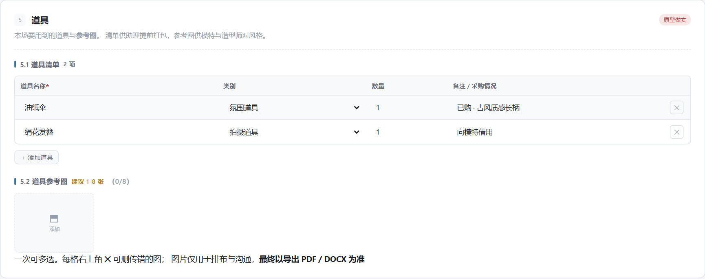 |
| §6 摄影器材 | 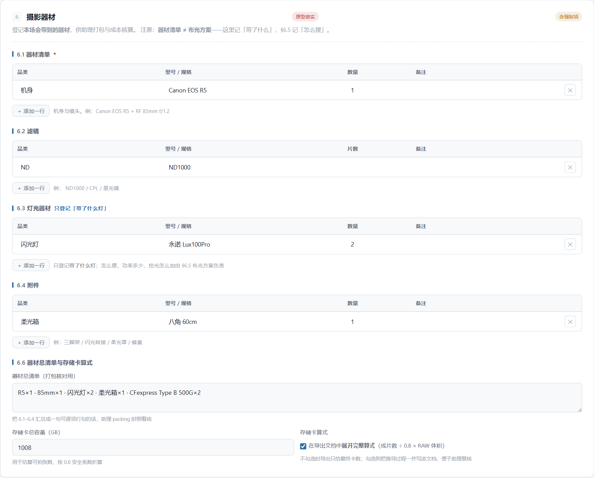 |
| §9 注意事项 | 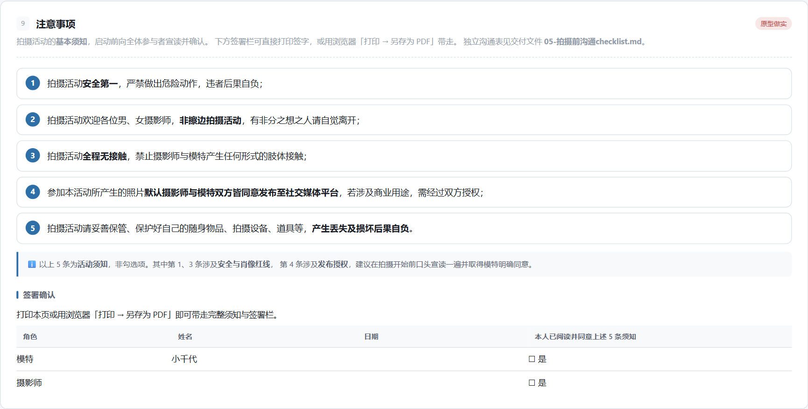 |
| §10 应急预案 | 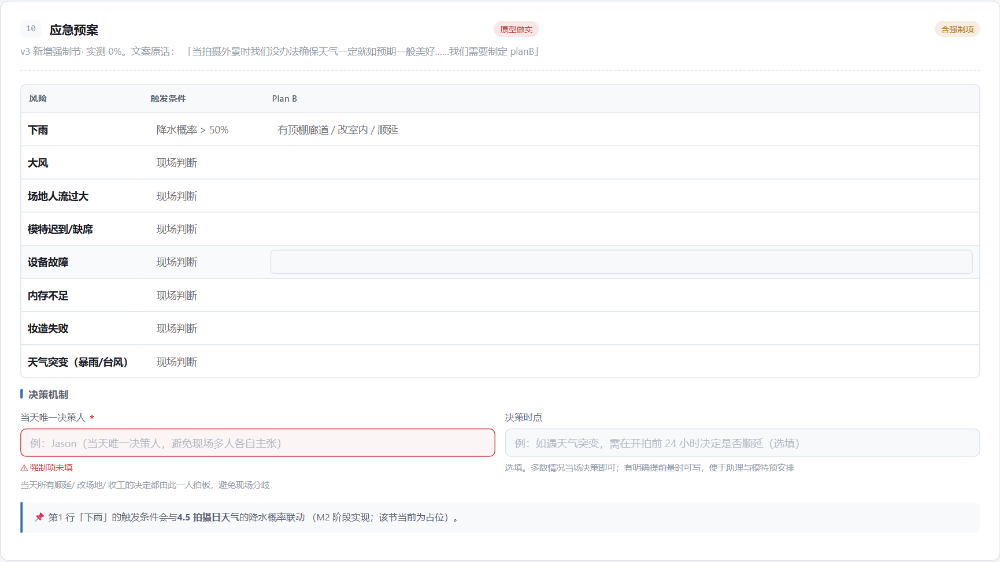 |
| 深色主题 | 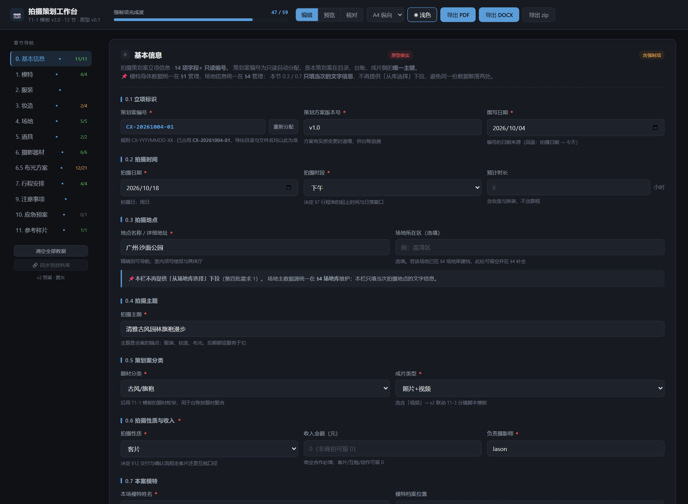 |
| 浅色主题（打印所见即所得） | 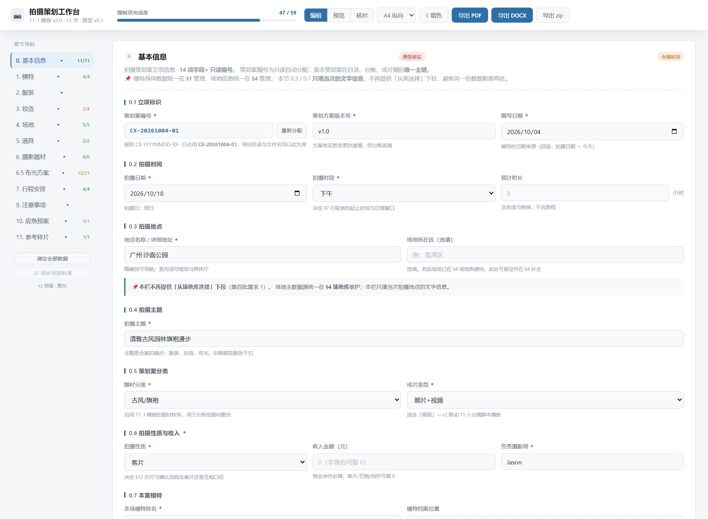 |

---

## 12 个章节

| # | 章节 | 做什么 |
|---|---|---|
| 0 | 基本信息 | 编号自动分配、拍摄时间地点、主题分类、性质收入、本场模特 |
| 1 | 模特 | 姓名/身高/体重/**样图 1-2 张**；模特库可复用 |
| 2 | 服装 | 上下身鞋袜融合为一行（旗袍、连衣裙无需拆分）；配饰可增行 |
| 3 | 妆造 | 必填「妆面风格 + 妆面参考图」与「发型风格 + 发型参考图」 |
| 4 | 场地 | 档案 7 要素 + 参考图 5-10 张；场地库可复用 |
| 5 | 道具 | 清单表（名称/类别/数量/备注）+ 道具参考图 |
| 6 | 摄影器材 | 器材/滤镜/灯光/附件四表 + 总清单 + **存储卡换算** |
| 6.5 | 布光方案 | 严谨/快捷双模式；光位 9 项、方向 11 项；3D 渲染图（仅严谨） |
| 7 | 行程安排 | **拍摄日时段轴**（含黄金时刻/日落）+ timetable + 耗时汇总校验 |
| 9 | 注意事项 | 5 条活动须知 + 签署确认表（可打印签字） |
| 10 | 应急预案 | 8 类风险 × 触发条件 × 应对；当天唯一决策人 |
| 11 | 参考样片 | 5-25 张参考图，用于和模特对齐风格 |

>章节编号跳号（无 §8、无 §12）是刻意的：这两节在 v1.0.0 开发过程中被裁掉，
>详见 [CHANGELOG](CHANGELOG.md)。

---

## 三个设计取舍

### 1. 上传图片是为了排布，导出才是终点

参考图在工具里显示得整齐，导出到 PDF / DOCX 才是交付物。
所以图片槽统一 **4:3 基准格 + 完整显示不裁切**，
不同宽高比的图也能网格对齐——一屏看全，导出时版式可控。

### 2. 编号是主键，不是标签

`CX-YYYYMMDD-XX` 由工具分配、只读、跨日重置、释放不撞号。
它是策划案在目录、台账、成片侧的**唯一主键**，
后续导出文件名、归档目录、台账溯源全以此为准。

### 3. 逼你确认的，只逼真正要确认的

强制项设计原则：**宁可漏项，不要形式主义**。

§7 行程表只有「事项」非空的行才计入必填——
否则点了「＋ 添加时段」还没填内容就被拦，反而是噪音。

---

## 已知限制

| 限制 | 影响 | 计划 |
|---|---|---|
| DOCX 导出未实现 | 只能打印成 PDF | v1.1。技术选型已完成（`dolanmiu/docx`），但它约 1.24 MB，内联会让文件涨到 1.3 MB+ |
| 数据存浏览器本地，换设备不同步 | 需手动「导出整案」再导入 | v2.1 走 File System Access 直写本地文件 |
| §6.3 灯光与 §6.5 布光分两处登记 | 需填两次 | 已用 hint 提示分工，考虑合并 |
| 4.94 MB 存储上限 | 约 6 个满配场地后触顶 | v2.0 加容量提示与写入告警 |
| Firefox / Safari | 文件系统 API 不可用 | v2.1 |
| 存储卡换算按 0.8 安全系数 | 与厂商标称略有差异 | 系数已固定，差异见使用说明 |

---

## 文档

| 文档 | 内容 |
|---|---|
| **[上手指南](docs/GETTING-STARTED.md)** | **从这里开始** · 15 分钟走完一份真实策划案（含截图） |
| [使用说明](docs/USER-GUIDE.md) | 逐字段参考手册 · 12 章节完整说明 + 数据管理 + FAQ |
| [Roadmap](docs/ROADMAP.md) | v1.0 → v3.0 规划、版本哲学与待拍板项 |
| [拍摄前沟通 checklist](pre-shoot-checklist.md) | 可直接发模特 / 摄影师的签署版 |
| [Changelog](CHANGELOG.md) | v1.0.0 完整变更记录 |

---

## 质量保障

- **246 项** Playwright 端到端断言全部通过，0 JS 运行时错误
- 覆盖：字段校验、必填拦截、模式联动、增删行、图片上传删除、数据落库
- 断言里包含对**法律性文案**的逐字校验（活动须知改一个字即失败）

---

## License

[MIT](LICENSE) © 2026 Jason
